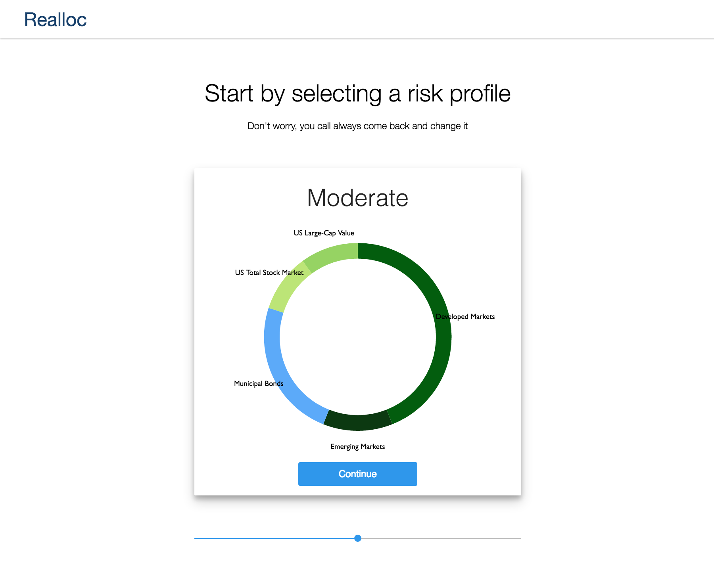
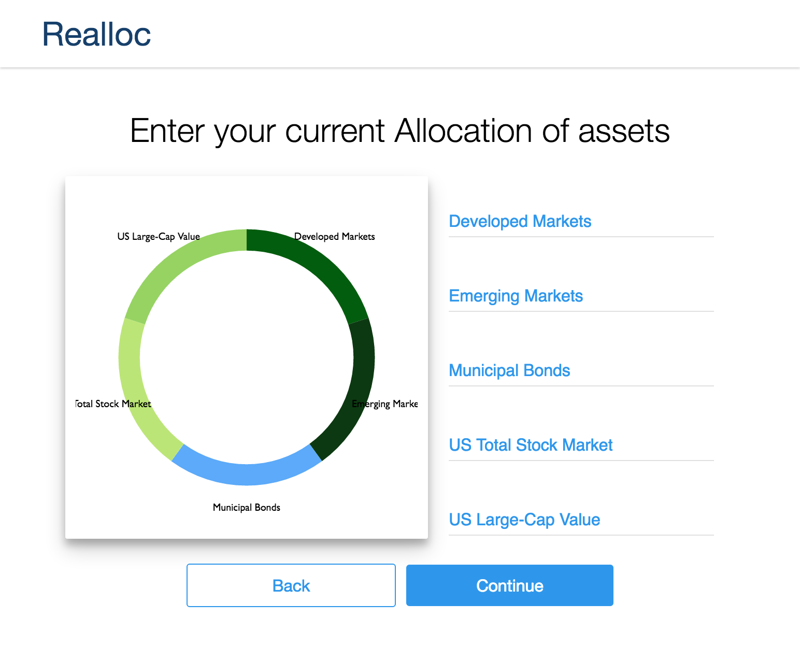

# Realloc

Reallocate your portfolio based on your desired risk profile.

[Live site](https://charleswcho.github.io/Realloc/)




## Setting up

Clone or download to get started.  In the project directory, you can run:

`npm install`<br>
`npm start`

Runs the app in the development mode.<br>
Open [http://localhost:3000](http://localhost:3000) to view it in the browser.


## Features & Implementation

### Responsive Design

One of the biggest goals in this project was to make it as responsive as possible. To achieve this I focused on designing the mobile layout first then reformatted for tablet and desktop.  

Utilizing Sass to create modular mixins helped keep the code as concise as possible.

```
$tablet-width: 600px
$desktop-width: 1024px

=tablet
  @media (min-width: $tablet-width) and (max-width: $desktop-width)
    @content

=desktop
  @media (min-width: $desktop-width)
    @content
```

Adding in a mixin was very simple

```
+tablet
  width: 350px
```

### ES6

To implement this page in ES5 would have entailed a large switch statement for the input callback.  



Instead, with computed properties in ES6, the callback is as simple as this.  

```javascript
  _inputChanged = (e) => {
    const val = parseInt(e.target.value, 10)

    // Dynamically set state with computed property
    this.setState({ [e.target.name]: val })
  }
```

The inputs are created directly from our state like so.

```javascript
<ul className='inputs'>
  {Object.keys(this.state).map((asset, idx) => {
    return (<AssetInput key={idx} name={asset}
                        inputChanged={this._inputChanged}/>)
  })}
</ul>
```

With this implementation all we have to do to create a new input field is add a value to our state.

## Optimizations

### Sass

The mixins could be even more modular by putting them into file and importing it.

## Future features

### Detail Modal

The user will be able to click on a specific chart and a modal will popup with an expanded view.
